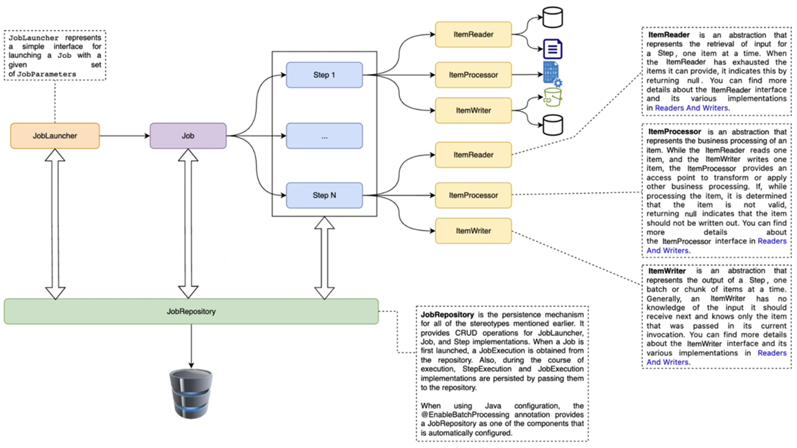
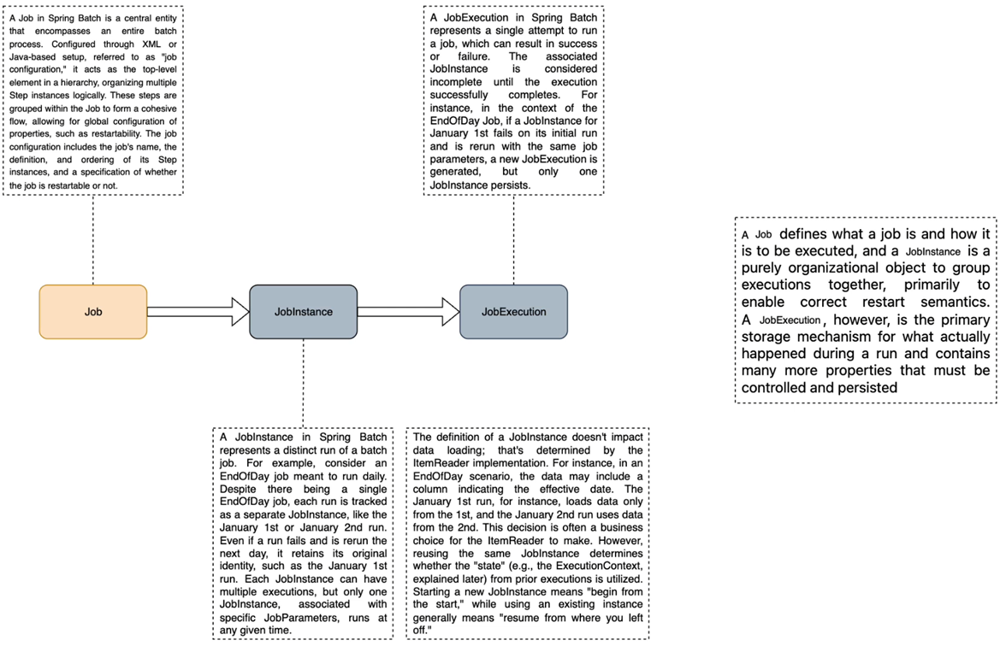
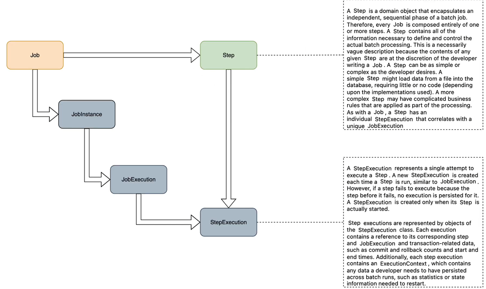

# [Spring Batch](https://www.youtube.com/playlist?list=PL41m5U3u3wwlKYP6yhLKaa09rB5aUMUnn)

Tutorial tomado del canal de **Bouali Ali**

Un marco de trabajo por lotes ligero y completo diseñado para permitir el desarrollo de aplicaciones por lotes robustas,
vitales para las operaciones diarias de los sistemas empresariales.

Spring Batch proporciona funciones reutilizables que son esenciales en el procesamiento de grandes volúmenes de
registros, incluyendo registro/rastreo, gestión de transacciones, estadísticas de procesamiento de trabajos, reinicio de
trabajos, omisión y gestión de recursos. También proporciona servicios y funciones técnicas más avanzadas que permitirán
realizar trabajos por lotes de gran volumen y alto rendimiento mediante técnicas de optimización y partición. Tanto los
trabajos por lotes sencillos como los complejos y de gran volumen pueden aprovechar el marco de trabajo de forma
altamente escalable para procesar volúmenes significativos de información.

### Características

- Gestión de transacciones
- Procesamiento basado en trozos
- I/O declarativa
- Start/Stop/Restart
- Retry/Skip
- Interfaz de administración basada en web (Spring Cloud Data Flow)

### Versión simplificada de la arquitectura de referencia por lotes

A continuación se muestra la versión simplificada de la arquitectura de referencia por lotes donde se proporciona una
descripción general de los componentes que conforman el lenguaje de dominio del procesamiento por lotes.



Centremos nuestra atención el componente `Job`:





---

# Inicio de Spring Batch Tutorial

---

## Dependencias

````xml
<!--Spring Boot 3.2.0-->
<!--Java 21-->
<dependencies>
    <dependency>
        <groupId>org.springframework.boot</groupId>
        <artifactId>spring-boot-starter-batch</artifactId>
    </dependency>
    <dependency>
        <groupId>org.springframework.boot</groupId>
        <artifactId>spring-boot-starter-web</artifactId>
    </dependency>

    <dependency>
        <groupId>org.postgresql</groupId>
        <artifactId>postgresql</artifactId>
        <scope>runtime</scope>
    </dependency>
    <dependency>
        <groupId>org.projectlombok</groupId>
        <artifactId>lombok</artifactId>
        <optional>true</optional>
    </dependency>
    <dependency>
        <groupId>org.springframework.boot</groupId>
        <artifactId>spring-boot-starter-test</artifactId>
        <scope>test</scope>
    </dependency>
    <dependency>
        <groupId>org.springframework.batch</groupId>
        <artifactId>spring-batch-test</artifactId>
        <scope>test</scope>
    </dependency>
</dependencies>
````
